# Bratislavský hrad – 3D prechádzka, ktorú za jednu noc postavila AI

**▶ Živá ukážka v prehliadači:** https://lukaskraic.github.io/bratislava-castle-3d/
(WebGL 2, prvé načítanie ~120 MB. Najlepšie v desktopovom Chrome, kliknutím do okna sa zachytí myš.)

> **TL;DR (EN):** A walkable first-person 3D model of Bratislava Castle, built autonomously by
> **Claude Code** in a single overnight session (~6 h, hard deadline). The model was given a one-line
> task, found and downloaded the data itself (OpenStreetMap, national LiDAR terrain, orthophotos,
> reference photos), wrote a procedural Blender generator and a Godot 4 walking game, tested walkability
> with an automated walk-through, and iterated on realism against real photos with help of
> code-review agents. A human only gave short nudges such as "too bright" or "look at the photos".

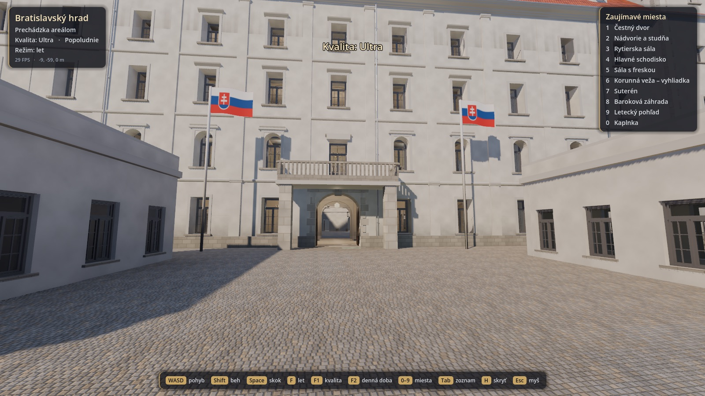

## Zadanie

Toto je ukážka toho, čo dokáže **Claude Code** (model Claude Opus 5.5), keď dostane voľnú ruku a limitovaný čas.
Celé zadanie znelo:

> *„chcem test vymodelovania bratislavského hradu čo najvernejšie, v blender, tak aby som sa vedel
> v ňom poprechádzať, povedz mi čo mám nainštalovať a dohľadaj si data, pracuj do 03:00, 3. 10. 2026"*

a neskôr *„úloha končí keď týždenný kredit, alebo v dohodnutom čase, inak vylepšuj, vylepšuj, vylepšuj,
môžeš si zavolať 3× codex na kontrolu kvality"*.

Nedostal **žiadne podklady**: ani pôdorysy, ani modely, ani fotky. Všetko si dohľadal, stiahol a spracoval sám.
Človek do práce zasahoval iba krátkymi pripomienkami, napríklad *„strašné, presvietené, nelogické veci,
dvere…"*, *„ak si budeš myslieť, že to máš dobré, pozri sa na fotky :-)"*, *„stále veľa svetla"*,
*„urob perfektne aj záhradu"*, *„väčšie detaily, stromy"* či *„vlajka by mohla viať vo vzduchu"*.

## Časová os

| Kedy | Čo |
|---|---|
| 2. 10. 19:55 | zadanie, kontrola prostredia, inštalácia Blendera (brew) |
| 20:00 – 20:30 | rešerš (subagent): rozmery paláca a veží, LiDAR, licencie; stiahnutie OSM, DMR 5.0 a ortofota ZBGIS |
| 20:30 – 21:30 | prvý generátor (palác, veže, interiér, terén, mesto) a Godot projekt (paralelný subagent) |
| 21:30 – 23:00 | spätná väzba „presvietené, nelogické": oprava svetiel, dvere, porovnávanie s fotkami z rovnakého uhla, záhrada z ortofota 5 cm/px |
| 23:00 – 02:10 | 8× Codex review a nezávislá vizuálna kontrola; suterén, Korunná veža, fresky, kaplnka, stromy z listových kariet, voda, obloha, noc |
| 3. 10. 02:10 | koniec v stanovenom čase (limit 03:00) |
| 5. 10. | web export, rozhranie s voľbou kvality, publikovanie na GitHub Pages |

**Čistý čas autonómnej práce:** približne 6 hodín. V priebehu práce bolo **8 kontrol kvality cez Codex**
a jedna nezávislá kontrola subagentom. Každá zmena bola overená automatickou prechádzkou s kolíziami
a sadou screenshotov z hry.

## Čo AI urobila sama

- **Dáta:**
  - OpenStreetMap (Overpass): pôdorysy, výšky, brány, hradby, schody, stromy, lavičky, lampy, fontány.
  - Výškový model **DMR 5.0 (LiDAR)**: vyčítaný bod po bode cez WMS GetFeatureInfo ÚGKK SR (mriežka 128 × 128 + okolie 3 × 3 km).
  - **Ortofoto ZBGIS** v troch mierkach. Z ortofota 5 cm/px je vystopovaný parter Barokovej záhrady
    (zimostrázové voluty, trávnik, tehlový štrk).
  - Referenčné fotky z Wikimedia Commons, podľa ktorých ladila proporcie (v repozitári nie sú).
- **Procedurálny generátor pre Blender** (`scripts/build_castle.py`, ~3 400 riadkov Pythonu):
  - palác so 4 vežami, skutočnými okennými otvormi, rímsami, vikiermi, žľabmi a strechou,
  - kompletný interiér s 5 podlažiami vrátane suterénu, schodísk a nábytku,
  - okolité budovy, hradby, schody, záhrada, stromy, Dunaj, Most SNP a Dóm sv. Martina.
- **Procedurálne textúry** v numpy (`scripts/textures.py`): omietka, škridla, žulové kocky, tehla, mramor, parkety, dub,
  listy, obrazy, freska, ku všetkým výškové a normálové mapy.
- **Godot 4 hra:**
  - pohyb v 1. osobe s kolíziami a krokovaním po schodoch,
  - denné doby vrátane noci, procedurálna obloha s mrakmi, animovaná voda a vlajky,
  - 4 stupne kvality a rýchly presun na zaujímavé miesta,
  - automatický test prechádzky, screenshoty a benchmark.

## Čo si pozrieť

| | |
|---|---|
| 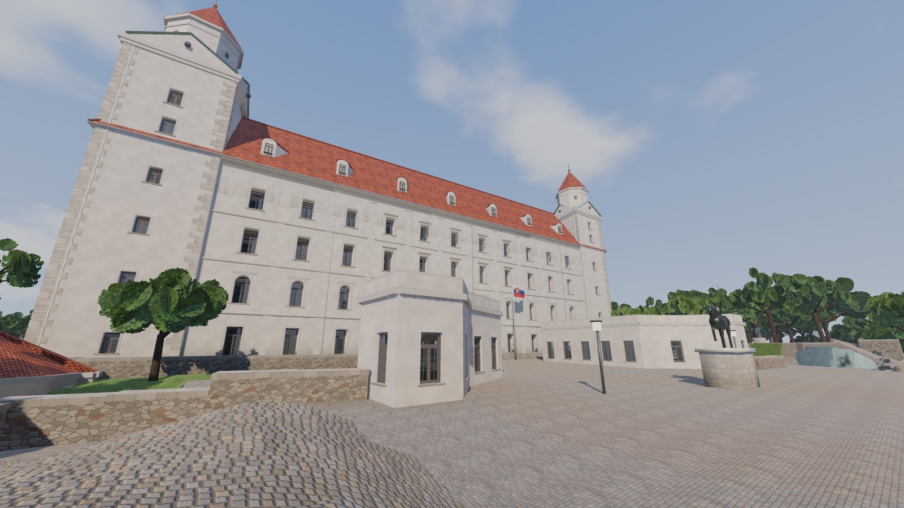 **Čestný dvor**: južná fasáda, Korunná veža, socha Svätopluka | 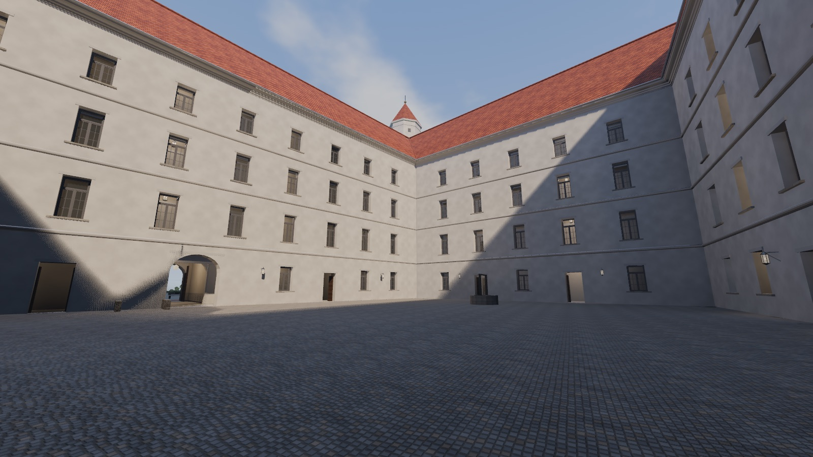 **Nádvorie** paláca so studňou na polohe z OSM |
| 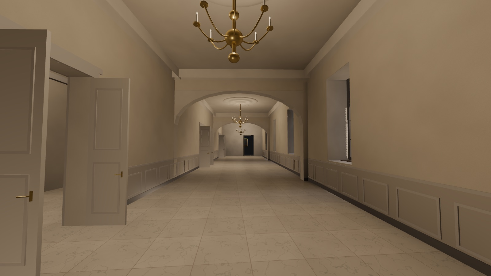 **Rytierska sála**: arkáda, mramor, lustre | 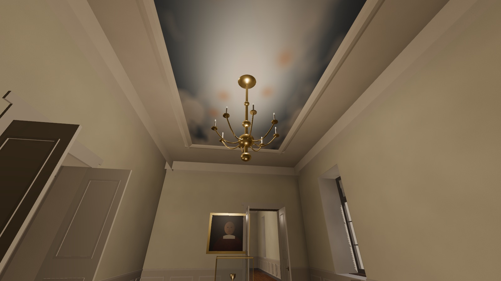 **Reprezentačná sála**: stropná freska, exponáty |
| 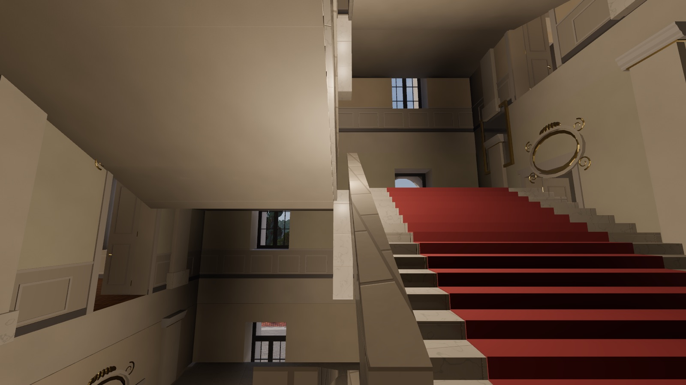 **Hlavné schodisko**: behúň, štuk, kartuše | 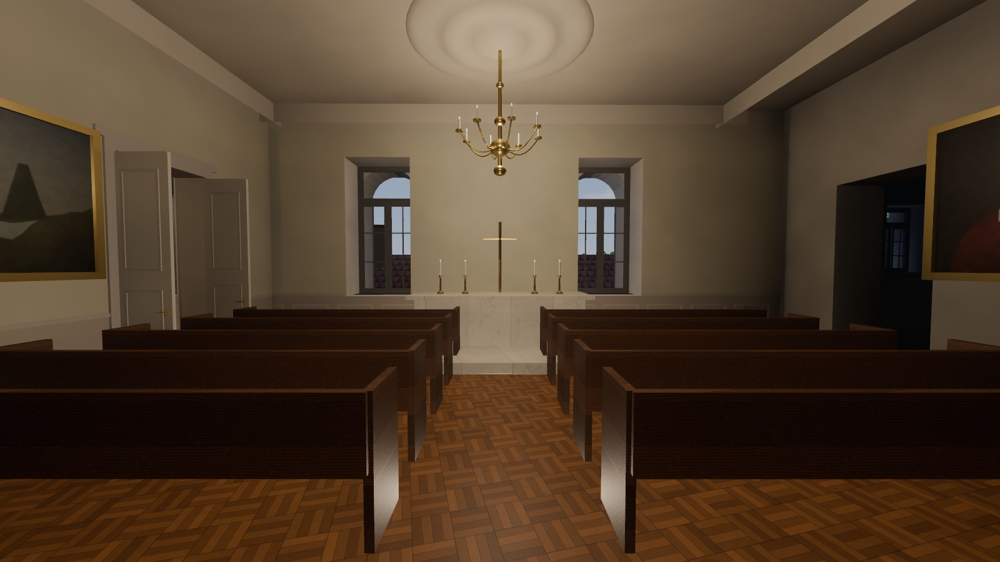 **Kaplnka** |
| 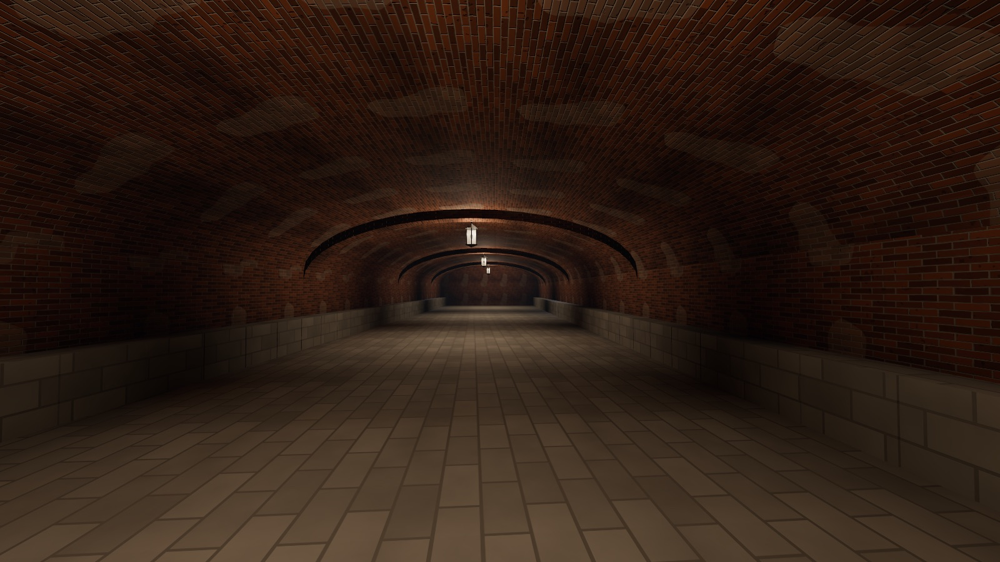 **Suterén**: tehlové klenby | 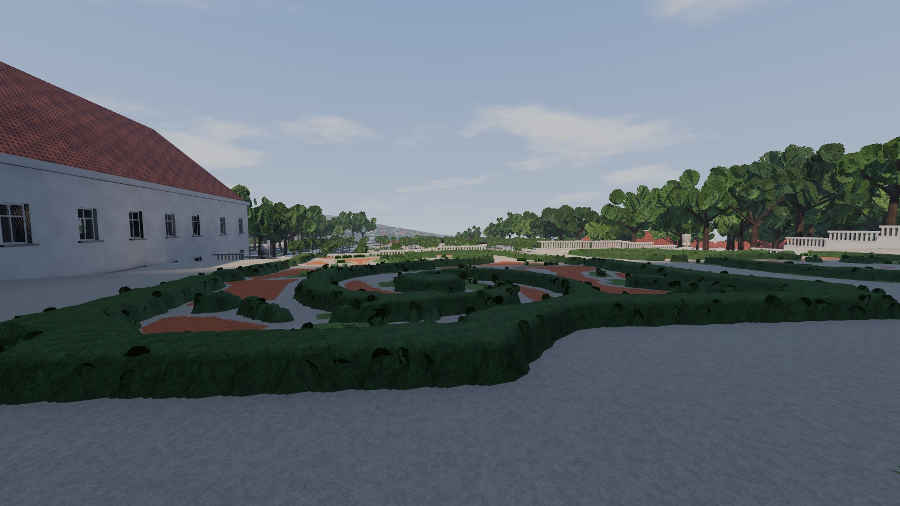 **Baroková záhrada**: parter z ortofota |
| 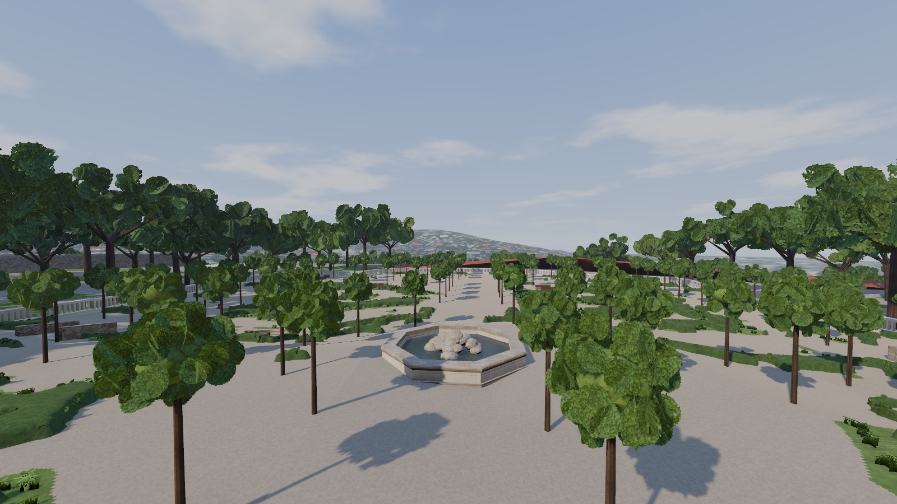 Strihané lipy a fontána | 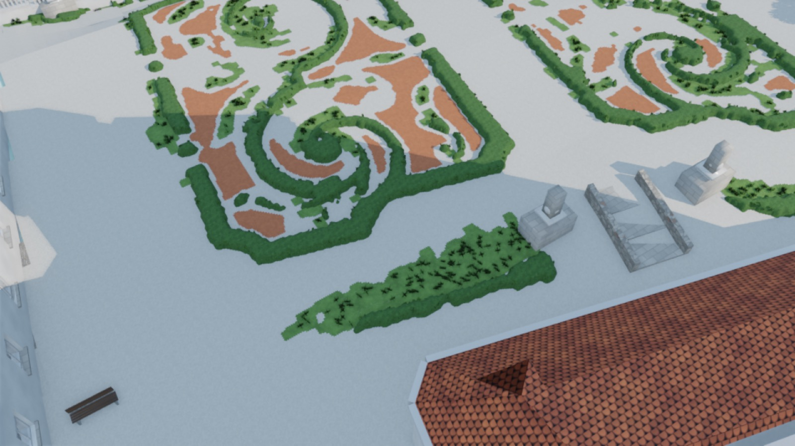 Brodériové záhony zhora |
| 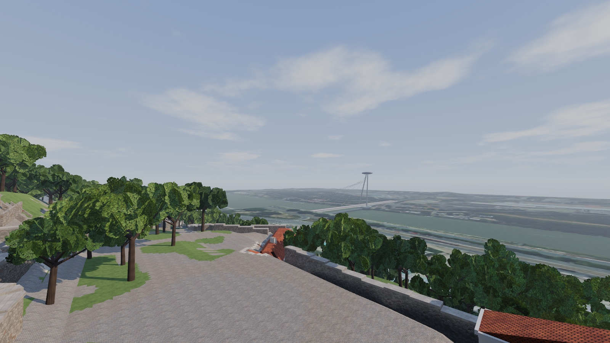 Výhľad na Dunaj, Most SNP a UFO | 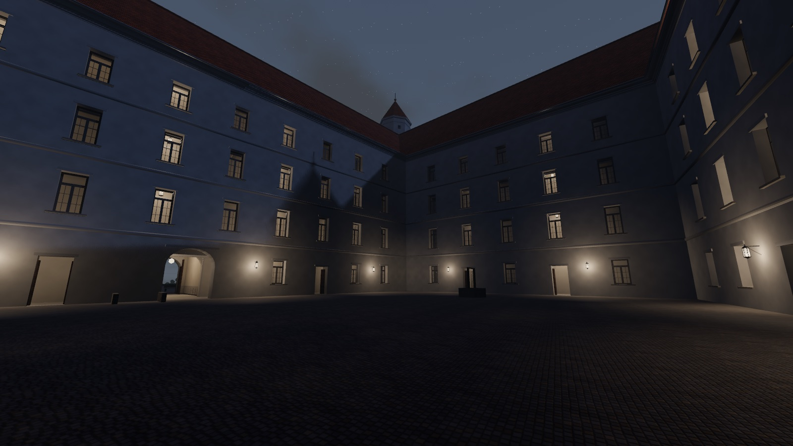 Noc na nádvorí |

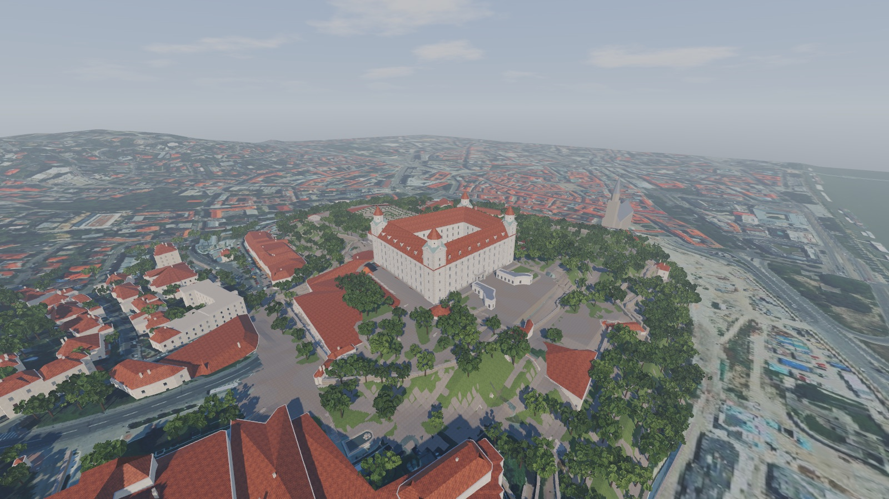

## Ovládanie

WASD pohyb, myš rozhliadanie, **Shift** beh, **Space** skok, **F** lietanie, **F1** kvalita (Nízka / Stredná /
Vysoká / Ultra), **F2** denná doba, **0–9** rýchly presun na zaujímavé miesta, **Tab** zoznam miest,
**H** skryje rozhranie, **Esc** uvoľní myš.

Web verzia beží na renderi Compatibility (WebGL 2) a nemá globálne osvetlenie ani odrazy (SDFGI, SSR).
Plnú kvalitu poskytuje desktopová verzia.

## Spustenie lokálne (macOS)

```bash
brew install --cask blender godot
/Applications/Blender.app/Contents/MacOS/Blender -b -P scripts/build_castle.py            # ~50 s -> out/castle.glb
./import_model.sh && ./run_godot.sh                                                       # desktop (Forward+)
/Applications/Blender.app/Contents/MacOS/Blender -b -P scripts/build_castle.py -- --web   # odľahčený model pre web
```

Testy: `godot --path godot -- --walktest` (automatická prechádzka s kolíziami: Čestný dvor → nádvorie, suterén,
poschodia, Korunná veža, záhrada), `-- --shots <dir>`, `-- --bench`.

## Čo je podľa dát a čo je odhad

- **Podľa dát:**
  - pôdorys paláca a nádvoria, okolité budovy, hradby, schody, brány,
  - terén,
  - polohy stromov, lavíc, lámp, sôch, studne a fontán,
  - parter záhrady.
- **Podľa fotiek:** proporcie veží (~45 m), okná, rímsy, vikiere, farby, Čestný dvor, pavilóny, balkón, socha.
- **Rekonštrukcia:** celý interiér, pretože verejné pôdorysy neexistujú. AI ho navrhla ako typickú barokovú dispozíciu
  a doplnila o známe miestnosti: Rytierska sála, Tereziánske schodisko, klenotnica v Korunnej veži, kaplnka, suterén.
- **Známe slabiny:**
  - obrazy a fresky sú zjednodušené,
  - schodisko je generické,
  - mesto v diaľke je ploché ortofoto,
  - okraje povrchov sú zblízka mierne zúbkované.

## Zdroje a licencie

- © prispievatelia **OpenStreetMap**, ODbL
- **ÚGKK SR / ZBGIS**: Ortofotomozaika SR, DMR 5.0 (otvorené údaje)
- Referenčné fotky z Wikimedia Commons slúžili len na porovnanie a nie sú súčasťou repozitára.
- Kód: MIT
